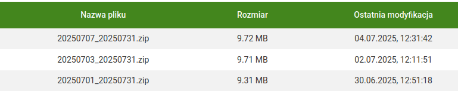

## why aiohttp

I didn't want to use fastAPI, because I think it is not required for API with only one endpoint - I want to keep project as small as possible. 

But I wanted async requests handling too - because it is more real-life thing. Thant's how I ended up with aiohttp, which takes only 2MB on disk and allows my application to run synchronous sqlite3 reads in different threads, making request handler asynchronous - the only time-consuming thing in my handler (reading data from DB) is delegated to another thread, which lets event loop to handle next requests while data read is performed. It wouldn't be possible for sqlite3 writes - write operation blocks database file for another threads.

## buses drive up to 30:14...

While testing some request, I found out that departure times went crazy in responses from my server:

```
    [
      "220",
      "GARBARY PKM",
      "29:13:00"
    ],
    [
      "221",
      "GARBARY PKM",
      "29:44:00"
    ],
    [
      "211",
      "GARBARY PKM",
      "30:14:00"
    ],
```

Yes, the bus comes to "Wielka" stop at 30:14 on this week's saturday - I strongly messed up something in my code... or did I?

Well, turns out that it's a feature, not bug - night buses on saturday night come to this stop at 30:14 on saturday, not 6:14 on sunday! And, to make it more funny, sunday's regular buses start arriving at 5:39 in the morning, so the trips from saturday's database and from sunday's database intertwine - just wow! 

## algorithm for dates handling

Problem: Poznan ZTM API sends data for future days that overrides previous schedules, for example:



Here we can see that on 04.07 came file that applies from 07.07 - so I have to save it for the future, without deleting current schedule, and switch to it when time for that comes.

Additionally, file 20250707_20250731.zip overrides the old file, that also ends on 31.07. So I should rearrange dates that this old schedule applies to. 

Here's my little algorithm for that:

1. first file has date from 01.07 to 31.07
2. save file `20250701-20250731.db`
3. new file comes - from 04.07 to 31.07
4. search files that override this range: `old_end_date > new_start_date` (in this case - `31.07 > 04.07 -> TRUE`)
5. change old file's name to `[start_date]-[new_start_date - 1].db`
6. save new file: `[new_start_date]-[new_end_date].db`
7. repeat steps 4-6 for every new file

Basing on historical ZTM data, there are no situations that are not handled by this workflow (for example, new file end date smaller that old file end date, and old file's schedule applying after end date of the new one)

## TODOs

- Add databases deletion after some time
- Make http server and thread that runs fetch once a day
- Add optional data from next day to request handler
- make esp client in micropython